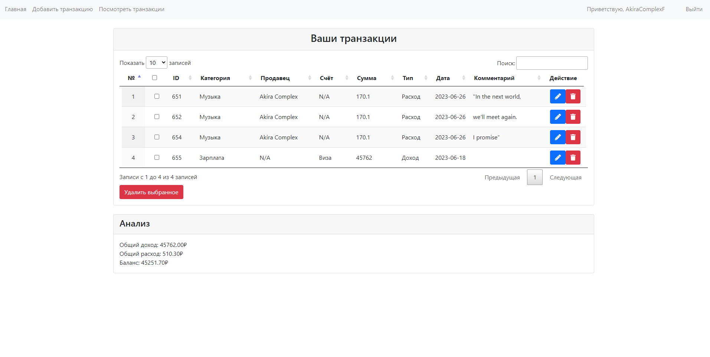
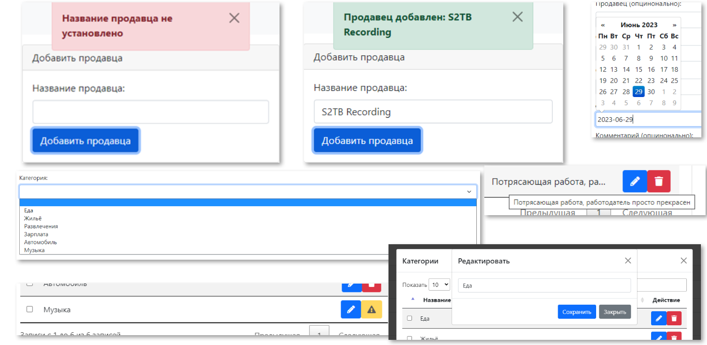

# Менеджер расходов BankruptBuddy
Проект, выполненный мною в одиночку без мам, пап и курсов, чтобы пережить четвёртый семестр в вузе (и пережил)\
\
Первый опыт в веб-разработке чего-то серьёзного (и поэтому `PHP 8.1`, `jQuery` и `Ajax` с разрабатыванием почти всего на сайте с нуля)\
\
Подробная информация о внешнем виде сайта и о стеке технологий в [презентации](github_assets/_BankruptBuddy.pptx)

## Немного об интерфейсе
  Есть страницы:
  - Главная
  - Логина и регистрации
  - Добавления транзакции и их параметров
  - Просмотра транзакций и редактирования

**которые выглядят нормально и на мобильных устройствах!*

  Есть модальные окна и стакающиеся высвечивающиеся уведомления

  Некоторые скриншоты сайта:

|  |
| :---------------------------------------: |
|             *Главная страница*            |

|  |
| :---------------------------------------: |
|      *Страница транзакций (нужен зум)*    |

|  |
| :---------------------------------------: |
|         *Особенности интерфейса*          |

## Технические особенности
+  Обновление списков в реальном времени
+  Регистрация и авторизация с `hash + salt`
+  Модель MVC
+ `MySQL`
+ `Eloquent` для работы с запросами к БД (избегание SQL Injection и неудобств с PDO)
+  Защита от доступа к файлам проекта (куда пользователь никогда не должен добраться)
+  Внимание к мелочам ❤️ (но очень редкие некритичные упущения могут быть)
+  Писал проект полностью на английском, а потом русифицировал :\

Забавно, но контроллер и роутинг написаны (мной) с нуля (даже используется вставка кода на месте особых комментариев перед показом страницы в браузере , навигационная панель и скрипты так и вставляются)\
\
Нельзя удалить категорию/продавца/счёт, если они используются в транзакции (при редактировании значок ⚠️ на месте кнопки удаления)\
\
Код писал с идеей относительно простой расширяемости (будучи пре-джуном :D)

## Установка
### Не думаю, что кто-то захочет возиться с такой установкой, лучше ознакомьтесь с проектом через [презентацию](github_assets/_BankruptBuddy.pptx)

Проект разрабатывал при помощи [`OSPanel`](https://ospanel.io/) на Windows 10\
\
Нужные модули:
   - HTTP: `Apache_2.4-PHP_8.0-8.1+Nginx_1.23`
   - PHP: `PHP_8.1`
   - MySQL: `MySQL-8.0-Win10`

Настраивал проект (не `OSPanel`) так:
1. Помещал файлы проекта в папку с серверами (domains)
2. Настроил чтение файлов из этой же папки в программе
3. Запустил сервер
4. На сайте `http://{хост сервера}:{порт сервера}/phpmyadmin/index.php?route=/server/sql` ввёл SQL из [expenses_manager_db.sql](/expenses_manager_db.sql)\
*И так как тут dotenv*:
5. В корне проекта нужен `.env` с параметрами:
```
DB_DRIVER=mysql
DB_HOST=127.0.0.1
DB_USERNAME=root
DB_PASSWORD=
DB_DATABASE=expenses_manager_db
DB_CHARSET=utf8
DB_COLLATION=utf8_unicode_ci
DB_PREFIX=
```
Они шаблонные и с ними проект должен заработать

### На всякий случай список использованных вещей и их версий

Использовались инструменты:\
\
Bootstrap 5.1.0\
jQuery 1.11.1\
PHP 8.1.9\
MySQL 8.0\
phpMyAdmin 5.2.0\
Apache 2.4\
Nginx 1.23\
CSS3\
HTML5\
JS\
bootstrap-datepicker 1.10.0\
phpdotenv 5.5.0\
Laravel/Eloquent 10.x\
jQuery DataTables 1.10.21\
Visual Studio Code 1.70.2\
Open Server 5.4.3\
Font Awesome 5.15.4\
Google Chrome 114.0.5735.134\
Composer 2.5.7
